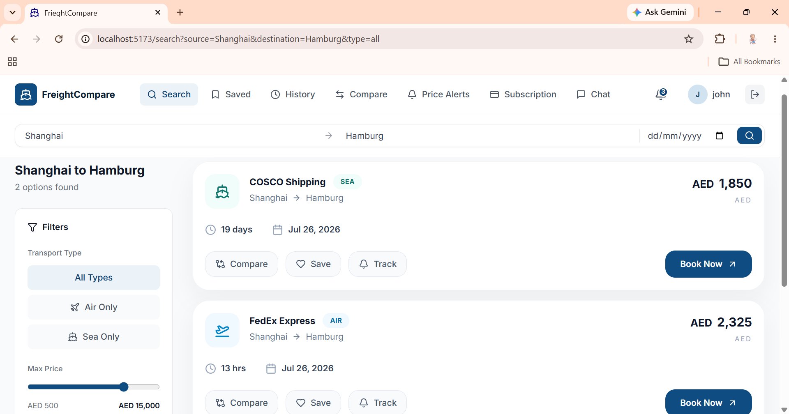
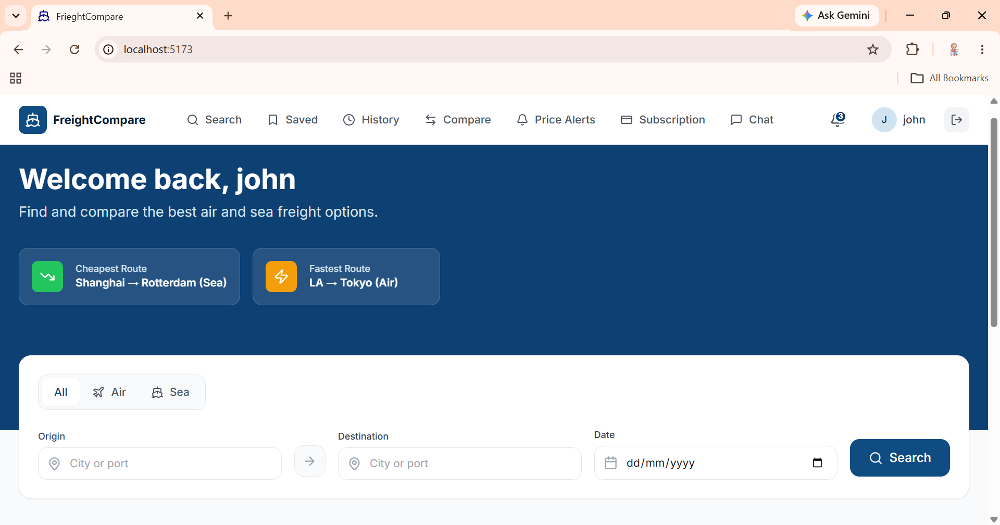
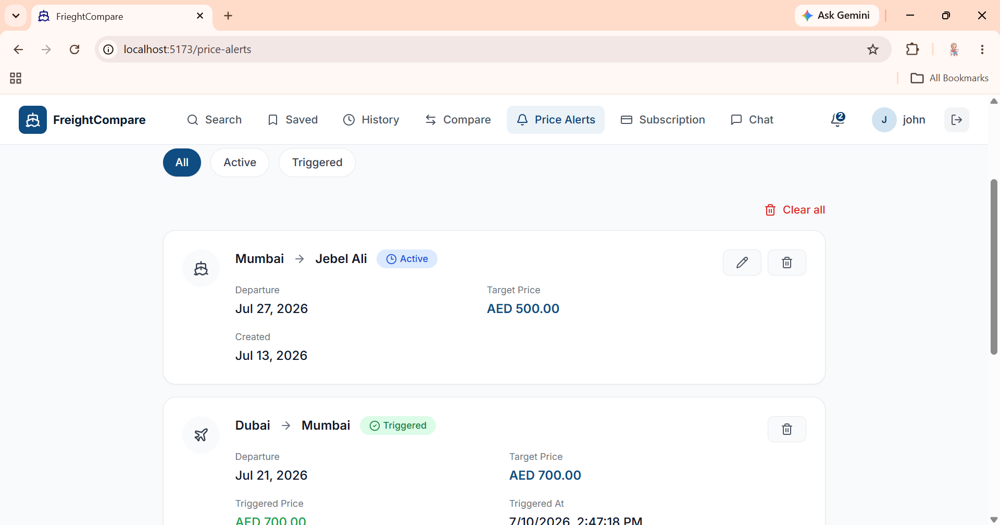
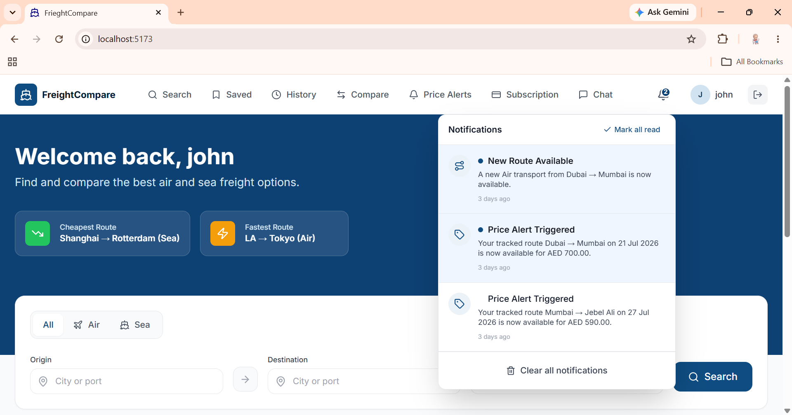
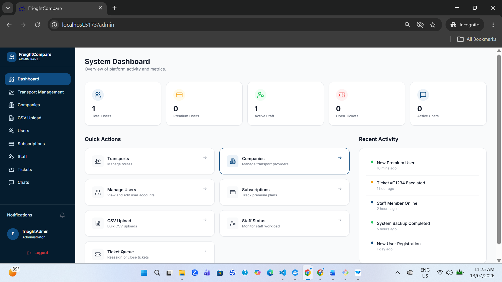
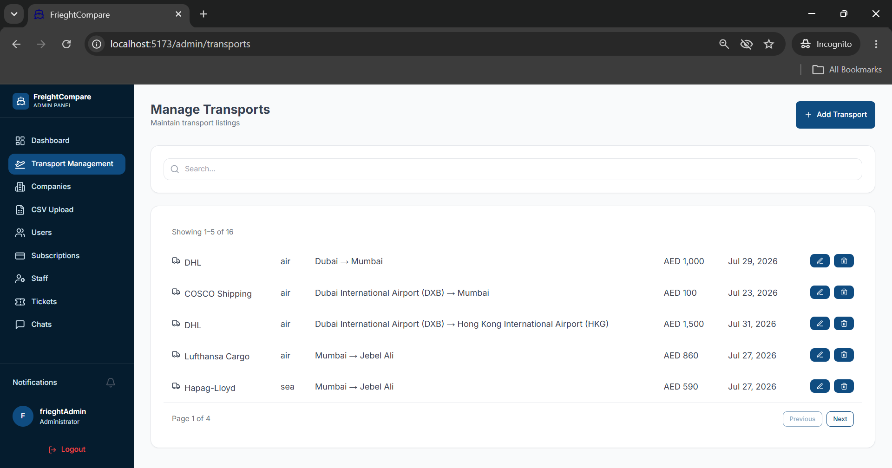
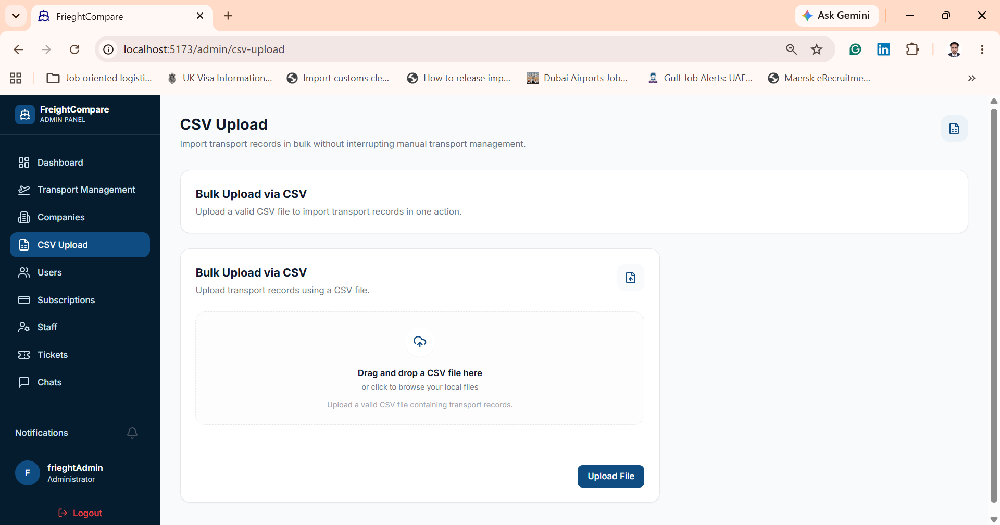
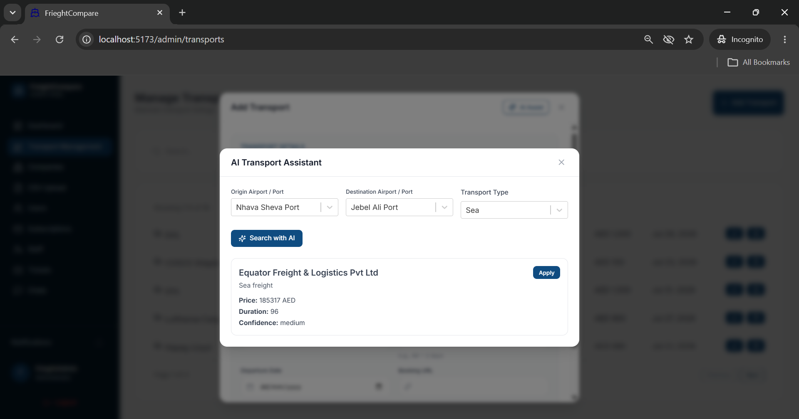

# 🚚 FreightCompare


An AI-powered freight comparison platform that enables customers to compare freight transport options, track prices, receive real-time notifications, and manage logistics operations through an intelligent and modern web application.

FreightCompare is built using **React**, **Django REST Framework**, **PostgreSQL**, **Docker**, **Redis**, and **Groq LLM**, providing a scalable architecture for freight comparison and logistics management.

## 📸 Application Preview




> 🚧 **Project Status:** Active Development
>
> Core freight comparison, AI assistant, administration, and real-time notification modules are complete. Remaining work includes Customer Support Chat, Ticket Management, Staff Assignment, and deployment.

## 📑 Table of Contents

- [Features](#-features)
- [AI Assistant](#-ai-assistant)
- [Real-Time Notifications](#-real-time-notifications)
- [Tech Stack](#-tech-stack)
- [Project Architecture](#-project-architecture)
- [Project Structure](#-project-structure)
- [Getting Started](#-getting-started)
- [Current Modules](#-current-modules)
- [Screenshots](#-screenshots)
- [Upcoming Features](#-upcoming-features)
- [Project Goals](#-project-goals)
- [Author](#-author)

## ✨ Features

### 👤 Customer

- Search and compare freight transport options
- Save favourite transport routes
- Search history
- Price alerts
- Real-time notifications
- Google Authentication
- JWT Authentication
- Premium subscription support

### 👨‍💼 Administrator

- Transport Management
- Company Management
- Customer Management
- Subscription Management
- CSV Bulk Upload
- AI Transport Assistant
- Dashboard

### 👨‍💻 Staff

- Staff Dashboard
- Notification Management

---

## 🤖 AI Assistant

FreightCompare includes an AI-powered transport assistant designed to simplify transport creation.

Features include:

- AI-assisted freight recommendations
- Tavily Search integration
- Groq Llama 3.3 integration
- Automatic company extraction
- Price extraction
- Duration extraction
- Confidence scoring
- One-click transport creation

---

## 🔔 Real-Time Notifications

Implemented using:

- Django Channels
- Redis
- WebSockets

Users receive instant notifications for:

- Price Alert updates
- Route Match notifications
- System notifications

---

## 🛠 Tech Stack

### Frontend

- React
- TypeScript
- Redux Toolkit
- Tailwind CSS
- React Router
- Axios

### Backend

- Django
- Django REST Framework
- PostgreSQL
- JWT Authentication
- Google OAuth

### AI

- Groq Llama 3.3
- Tavily Search API

### Real-Time

- Django Channels
- Redis
- WebSockets

### DevOps

- Docker
- Docker Compose

---

## 🏗 Project Architecture

```
                    React Frontend
                           │
                    Redux Toolkit
                           │
                        Axios API
                           │
──────────────── REST API ────────────────
                           │
               Django REST Framework
                           │
                  Business Logic Layer
                           │
                     PostgreSQL Database
                           │
                         Redis Cache
                           │
                    Django Channels
                           │
                      WebSockets
                           │
                  Real-Time Notifications
```

---

## 📂 Project Structure

```
FreightCompare
│
├── backend
│   ├── ai
│   ├── companies
│   ├── notifications
│   ├── price_alerts
│   ├── saved
│   ├── subscription
│   ├── transports
│   └── users
│
├── frontend
│   ├── components
│   ├── pages
│   ├── redux
│   ├── api
│   └── types
│
├── docker-compose.yml
└── README.md
```

---

## 🚀 Getting Started

### Clone Repository

```bash
git clone https://github.com/HibahMohammedK/FreightCompare.git

cd FreightCompare
```

### Run with Docker

```bash
docker compose up --build
```

Backend

```
http://localhost:8000
```

Frontend

```
http://localhost:5173
```

---

## 📌 Current Modules

- ✅ Authentication
- ✅ Google Login
- ✅ Customer Dashboard
- ✅ Transport Comparison
- ✅ Saved Routes
- ✅ Search History
- ✅ Price Alerts
- ✅ Real-Time Notifications
- ✅ AI Transport Assistant
- ✅ Company Management
- ✅ Transport Management
- ✅ Customer Management
- ✅ Subscription Management
- ✅ CSV Upload
- ✅ Dockerized Development

---

# 📸 Screenshots

## 👤 Customer Experience


## Landing Page



---

## Transport Search


---

## Price Alerts



---

## Real-Time Notifications



---

## 👨‍💼 Administration


## Admin Dashboard



---

## Transport Management



---

## CSV Upload



---

## AI Transport Assistant



---

## 🚧 Upcoming Features

- Staff Assignment (Round Robin + Weighted Assignment)
- Customer Support Chat
- Ticket Management System
- Cloud Deployment

---

## 🎯 Project Goals

The objective of FreightCompare is to modernize freight comparison by combining traditional logistics management with AI-powered recommendations and real-time communication technologies.

The project focuses on:

- Improving transport comparison
- Intelligent logistics recommendations
- Better customer engagement
- Scalable system architecture
- Modern software engineering practices

---

## 👩‍💻 Author

**Hibah Mohammed K**

Software Developer | Full Stack Developer

- 🌐 GitHub: https://github.com/HibahMohammedK
- 💼 LinkedIn: https://www.linkedin.com/in/hibah-mohammed-k/

---

## 📄 License

This project was developed as a portfolio project to demonstrate modern full-stack software engineering practices using React, Django, AI integration, and real-time communication technologies.